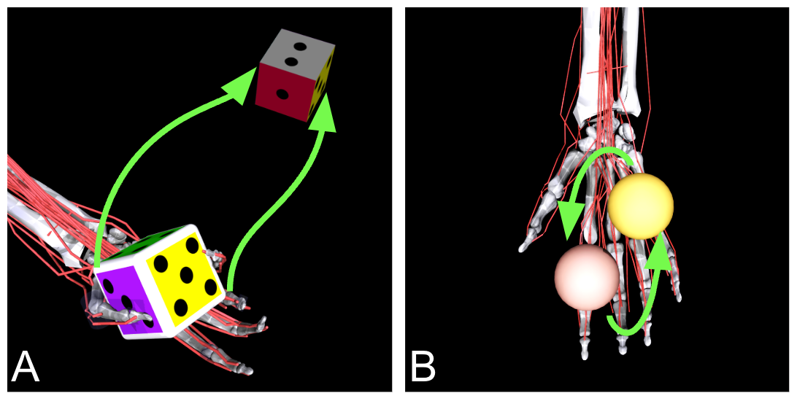

[](https://github.com/facebookresearch/myosuite)
[](https://twitter.com/MyoChallenge)

# 2022 NeurIPS - MyoChallenge

<p align="center">
  
  <p align="center"><i>MyoChallenge Tasks</i></p>
</p>

Welcome to the [**2022 NeurIPS - MyoChallenge: Learning contact-rich manipulation using a musculoskeletal hand**](https://sites.google.com/view/myochallenge/myochallenge).
This challenge consists of developing controllers for a physiologically realistic musculoskeletal hand to solve dexterous manipulation tasks:

- A) **Die reorientation task** reconfiguring the die to match the desired orientation (`myoChallengeDieReorientP1-v0`)

- B) **Baoding ball task** involving simultaneous rotation of two free-floating spheres over the palm. (`myoChallengeBaodingP1-v1`).

In order to submit your solutions, please add the [prerequisites](#Prerequisites) and then follow the 4 steps below.
In short, after the installation of the [prerequisites](#Prerequisites), the upload of a solution will follow this sequence:

``` bash
# Step 1 and 2 -- Train model and personalize agent evaluation script.
# Those steps can be skipped using the template agents e.g. agent/agent_die_rotate.py, to test the submission system
## Test that agent agent communicate with environment
sh ./test/test_die_agent.sh

# Step 3: Build docker container
docker build -f docker/agent/Dockerfile_DieEnv . -t myochallengeeval_die_agent

# Step 4: Upload policy
evalai push myochallengeeval_die_agent:latest --phase myochallenge-diephase1-1844 --public

```
> [⚠️ Important!] We have updated the task horizon for the Die Reorient task. Plese use MyoSuite >= 1.2.1

## Prerequisites
<details closed>
<summary>Install Docker compiler</summary>

Install docker following the [instructions](https://docs.docker.com/get-docker/). Once installed, you can compile the docker containers for the 2 agents with the following scripts:

Note: Do not use `sudo` privileges, rather manage Docker as a [non-root user](https://docs.docker.com/engine/install/linux-postinstall/). Building the docker with root privileges might cause problems during the evalai submission.
</details>

<details closed>
<summary>Register an account on evalAI for the team </summary>

Install EvalAI Command Line Interface (*evalai-cli*)
```bash
pip install "evalai>=1.3.13"
```

[⚠️ IMPORTANT ⚠️] Each team needs to be registered to obtain a specific token to identify it (see [instructions](https://evalai.readthedocs.io/en/latest/participate.html)). After registration, it is possible to add the EvalAI account token to via evalai-cli (full list of commands [here](https://cli.eval.ai/)) with the following command:
``` bash
# Register the tocken to identify your contribution
evalai set_token <your EvalAI participant token>
# Test that the registration was successful. MyoChallenge needs to be in the list returned
evalai challenges --participant
```

</details>

<details closed>
<summary>Clone this repository </summary>

Clone this repository to have access to all needed files:
```bash
# Clone the repository
git clone https://github.com/ET-BE/myoChallengeEval.git
# Enter into the root path
cd myoChallengeEval
# Install dependencies and tests
source ./setup.sh
```
</details>

## STEP 1: Train your model
The API to interface with the environment is via. [MyoSuite](https://github.com/facebookresearch/myosuite)).

More information on the training and customization are provided [here](./agent/TrainingPolicies.md)

<!-- For this challenge you might want to try the `myoHandDieReorientFixed-v0` for a quick test of training a policy (it should take ~2h on a regular laptop) and test the evaluation process. -->

## STEP 2: Customize Agent Script
We provide 2 templates to describe how the agent will communicate with the environment during the evaluation.
-  Die Rotate script ([agent_die_rotate.py](/agent/agent_die_rotate.py))
-  Baoding Ball script ([agent_baoding_ball.py](/agent/agent_die_rotate.py))

In both templates, you will need to (A) [import a policy](https://github.com/ET-BE/myoChallengeEval/blob/613410d7c80e4ea20ce7e3060f7aa751cd7e6361/agent/agent_die_rotate.py#L18) and (B) obtain [an action from each observation](https://github.com/ET-BE/myoChallengeEval/blob/613410d7c80e4ea20ce7e3060f7aa751cd7e6361/agent/agent_die_rotate.py#L40).
it is imported a policy trained with MJRL for testing. It is important that this line is customized with the policy you have trained. It is then possible to add all the dependencies in the [requirements file](requirements/agent.txt).

Once customized the agents, it is possible to test the communication between agent and environment using the test scripts:
- Die Rotate `sh ./test/test_die_agent.sh`
- Baoding Ball `sh ./test/test_bb_agent.sh`

Upon successful testing, it is possible to submit the solution following next steps.

Also, an example showing how to customize the set of observations is provided: ([agent_random.py](/agent/agent_random.py))

## STEP 3: Build a docker container with the agent
The evaluation will be based on the model submitted as a docker container. It is possible to build the docker in two ways with either directly docker build (Suggested Method) or with docker-compose (Alternative Method, this will require to install [docker-compose](https://docs.docker.com/compose/install/))
<details open>
<summary>Suggested Method: Using `docker build`</summary>

``` bash
# Compile the container for the Die Reorienting Agent
docker build -f docker/agent/Dockerfile_DieEnv . -t myochallengeeval_die_agent

# Compile the container for the Die Reorienting Agent
docker build -f docker/agent/Dockerfile_BBEnv . -t myochallengeeval_bb_agent
```
</details>

<details close>
<summary>Alternative Method: Using `docker-compose`</summary>


``` bash
# Compile the container for the Die Reorienting Agent
docker-compose -f docker-compose-DieAgent.yml up --build

# Compile the container for the Die Reorienting Agent
docker-compose -f docker-compose-BBAgent.yml up --build
```
</br>
</details>


## Step 4: Upload the docker container on evalAI for evaluation

Push docker image to [EvalAI docker registry](https://eval.ai/web/challenges/challenge-page/1615/submission) (it is possible to get the information about the image and TAG with the command `docker images`)

```bash
evalai push <image>:<tag> --phase <phase_name>
```
Use --private or --public flag in the submission command to make the submission private or public respectively.

for example, commands to upload agents might look like:
- Die Reorientation Agent : `evalai push myochallengeeval_die_agent:latest --phase myochallenge-diephase1-1844 --public`

- Baoding Ball Agent: `evalai push myochallengeeval_bb_agent:latest --phase myochallenge-bbphase1-1844 --public`

For more commands, please refer to [evalai-cli documentation](https://cli.eval.ai/) for additional commands.


### KNOWN ISSUES


If error to install `grpcio`, a solution is to install it manually

```bash
pip install grpcio
pip install grpcio-tools
```

It might be needed to make the path visible via:
```bash
export PYTHONPATH="./utils/:$PYTHONPATH"
export PYTHONPATH="./agent/:$PYTHONPATH"
```
